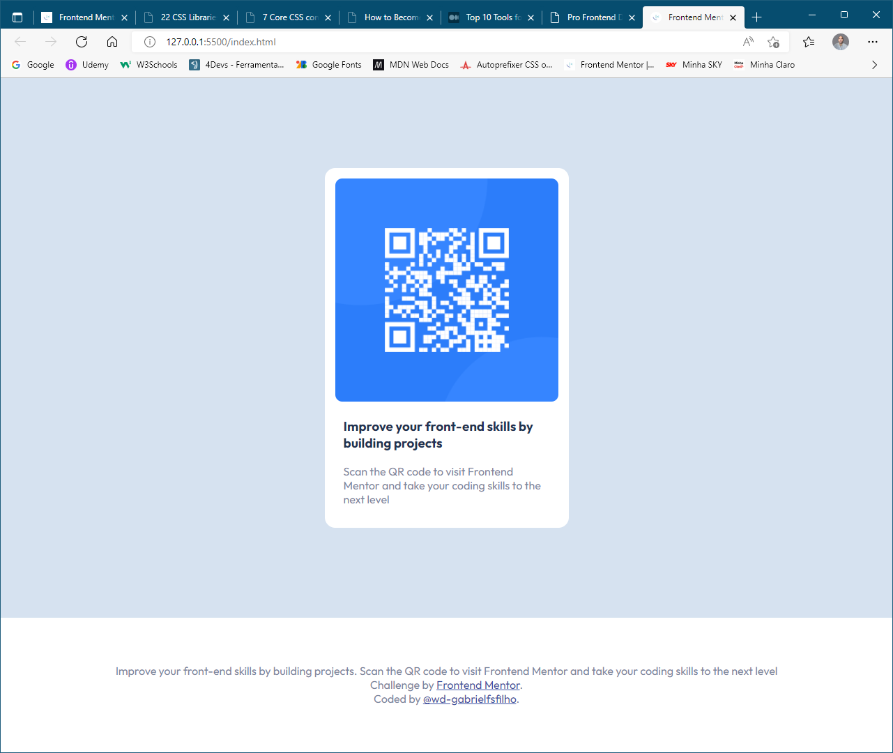
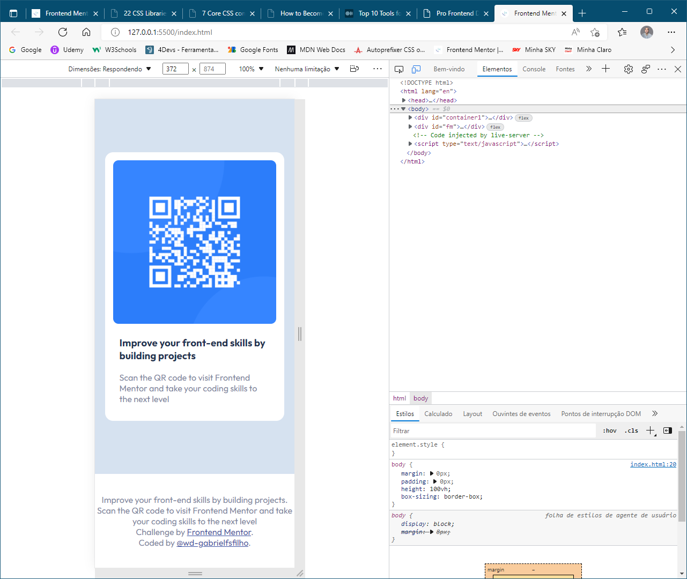

# Frontend Mentor - QR code component solution

This is a solution to the [QR code component challenge on Frontend Mentor](https://www.frontendmentor.io/challenges/qr-code-component-iux_sIO_H). Frontend Mentor challenges help you improve your coding skills by building realistic projects. 

## Table of contents

- [Screenshot](#screenshot)
- [Built with](#built-with)
- [What I learned](#what-i-learned)
- [Author](#author)

### Screenshot

### Built with

- HTML5 markup
- CSS 3 custom properties
- Flexbox
- Desktop-first workflow

### What I learned

- Follow orders
- Build a one scroll page

## Author

- Frontend Mentor - [@wd-gabrielfsfilho](https://www.frontendmentor.io/profile/wd-gabrielfsfilho)